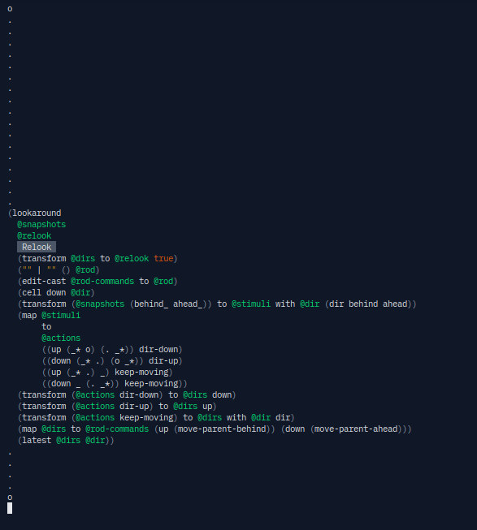

# Wirewright

**Warning**: ~~you won't be able to run anything right now because of `StringLiteral#scan`, a method I've
had to patch into the Crystal compiler. If I will get it into Crystal then you will be able to run the stuff.
Besides, there is nothing to run yet except for tests :^)~~ UPD: my `StringLiteral#scan` PR was merged into
the master branch of Crystal and will be available in Crystal 1.16. There is still nothing interesting to run though!
Except for tests! Running them is straightforward: `crystal run pattern6_test.cr`. Don't ask me why pattern6.
Don't ask me why it's testing pattern7. baz5? No idea.

UPD UPD: now there is something more interesting to run, `crystal run pprint2_vis.cr`. A gallery
of interesting examples made using it is found below.

Wirewright is a rewrite environment for self-embodied programs.

I am working hard to package the hundreds of thousands of lines of "all over the place" code I've written and about two years of ideas and exploration into something simple, usable, and practical. Please wait and wish me a lot of energy :)

## Gallery

### Frontend: soma6

https://github.com/user-attachments/assets/20107e02-a23b-43ed-9b57-591e2ea49f71

### Frontend: pprint2_vis

A 45-minute video where I try to explain (and fail, I guess, given it's 45 minutes?) what some of this is.

[Wirewright as an alternative to compilation and interpretation: building a counter ­— YouTube](https://youtu.be/SQP96xtfLvc)

NOTE: stuff is much snappier in reality, GIFs compress a lot of that snappiness.

**Interactivity in µsoma**

**A jumping self-embodied program ("ping-pong")**

## Upcoming "selling points"

**Warning**: Wirewright is several months away from a working [prototype](https://youtu.be/eUkZNk90rbQ). These "selling points" are for the far future.

1. The core idea of Wirewright is to base the entirety of interaction and programming on indirect self-modification; to make self-modification intuitive, nondestructive, and easy to reason about.
2. Wirewright considers itself a logical continuation of Lisp (as an idea, I suppose). Lisp made code and data "translatable" into each other, yet in Lisp they (or rather, their "roles") are still distinct: some lists are code and others, data. Wirewright, on the other hand, attempts to rid of the idea of code altogether. In Wirewright, everything is data ­— and nothing is code. In a way, Wirewright is the "ultimate", “universal program”, to which anything is an input; similar to some solvers out there, but somewhat more general-purpose.
3. Wirewright is remotely related to the general programming approach named "functional core, imperative shell". As such an “imperative shell”, Wirewright integrates all communication and interaction with the outside world into a coherent whole that the self-embodied program can interact with. Communication over the network, access to database, storage, graphics, and more — all by interacting with Wirewright.
4. **µsoma** is a unified graphical user interface to Wirewright.
5. Wirewright acts simultaneously as an *observer* and an abstract kind of *physics* for the "functional core" ­— a self-embodied program. It reacts to changes in the latter and provides feedback through rewriting (but not necessarily; for instance, UI is simply a way to view the self-embodied program, like some weird "glasses" that show `(button "Increment" @actions)` as a rectangle with centered text).

## Want to learn more?

### More of my ramblings

See the ramblings/ directory to read more of my ramblings. None of those are of publishing quality and most are probably going to read like pseudo-scientific nonsense. Sorry.

### Videos

I've recorded a few proto-prototypes of Wirewright some time ago. Note that I do not know whether they will reflect what Wirewright will become in reality. I do have a rough idea of where I'm going and fairly detailed plans of getting there, but still  — a plan stops working the moment you start following it.

- [Wirewright µsoma unitary interpreter demo 3 — YouTube](https://youtu.be/P48VAbvai2w)
- [Wirewright µsoma code can edit itself — Wirewright µsoma reflection demo — YouTube](https://youtu.be/MFME6DtHtKo)
