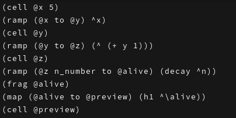
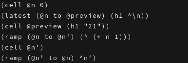
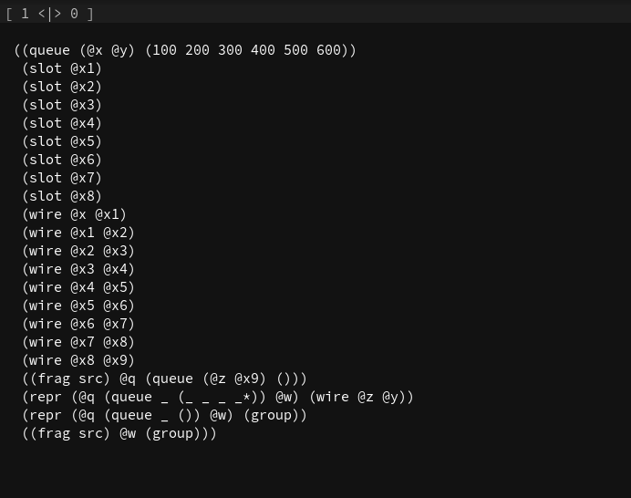

# Wirewright

> [!WARNING]
> All development happens on the [iota branch](https://github.com/wirewright/wirewright/tree/iota). This branch, kappa, is a snapshot of Wirewright before I nuked
> it with changes incompatible with the old way of doing things.

Imagine roads driving cars. Imagine a sculpture deliberately shaping the way the wind flows around it.

Imagine, now, a programming environment that *runs around* passive programs, instead of active programs *running in it*.

An environment that flows and adapts itself based on its population of programs, each one static -- a pile of symbols, that's it. Think HTML, but an actual general-purpose programming language. No `for`s, no `while`s, no `if`s.

Remember the sculpture? Not only the sculptor crafts it, but also the wind -- the environment. The sculptor can be very smart and design their sculpture with that in mind.

Sure.

But how do you do anything practical with such an arrangement? Enter *symbolic physics*, *pattern matching*, and *feedback*, among many other peculiar techniques!

With symbolic physics, your program will likely look like a carefully engineered structure of symbolic "ramps", connected by "wires", containing "observers", with relations set up between different spots of the entire concoction -- *the document*.

You may want to set up some "node factories", too. A document consists of *nodes*, and you can make nodes that make other nodes on demand. They will look around using *pattern matching* and make whatever is necessary.

You'd then seed everything with some values -- and observe how they literally "roll down" the ramps, flow through wires, are observed, and nodes are synthesized based on them.

Chain reactions, *feedback loops* (see the word loops here?), and user interaction may alter the flow of data. They open one pathway and close another, leading observers to trigger further effects. No `while`s, no `if`s, and yet it loops and decides.

Instead of having a program in the usual sense, one that perhaps evaluates to `42` -- in other words, one that *decays* or *destroys* itself with computation, -- with Wirewright, you'd have a program that *heals* itself.

So you set up a world and that world has a custom kind of physics running in it, *symbolic physics*. It detects "gaps" and fills them as necessary, but at no point would the world pop out of existence with the answer `42`. At most, you'd have a slot of some kind right there in the program show `42`, and if you change the inputs, you'd see a different number in that same slot.

That's roughly what I'm trying to implement here with Wirewright. An environment that adapts to programs, for programs that adapt to environments. No more clockwork!

So that's roughly what I'm trying to implement here with Wirewright. An environment that adapts to programs, for programs that adapt to environments. No more clockwork!

I'm working really hard on Wirewright, because I think this idea deserves to exist. It definitely has cons just as it has pros, of course. But before detailing them, it'd be nice for the thing to exist first.

Documentation is scarce and the code is in flux. There are no version numbers yet. Everything is a prototype. Large parts of the project are being written and rewritten at the moment. I believe that if this thing is going to work, then its scope would be similar to web browsers (quite unfortunately for me!) And that's no easy task. The project is quite small at the moment (~40kloc-ish, depends on how you count) -- given the scope, that is. My expectation is that it will grow very much, because foundational things like terms are currently implemented in a very naive way, making the whole thing rather slow. They'd require data structures that are vastly smarter and more complex. Think of it this way: right now I have slow, stupid general paths for everything. In the future I'd like to have lots and lots of fast paths, and a smart general path. This is expected to grow out of control, unfortunately. But that's how things stand, don't they?

On documentation, I'm part lying here. There's lots of docs, you just have to look for them. The levels of boredom I experienced while writing them you can't even imagine! User docs can be found by searching for `# |@ ` in the code; do a grep or something. I just don't have the time to write a front-end that would scrape and show them. Code docs (Crystal) are OK although I don't expect anyone other than myself to read and understand them.

## Gallery

### Frontend: soma6

https://github.com/user-attachments/assets/e86cb81d-67d7-45b8-8a68-7399e4fe367e

### Frontend: Wirewright Rack

## References

Wirewright runs on the ideas inspired by or directly taken from: Francisco Varela, Humberto Maturana, Stephen Wolfram, Niklas Luhmann, Michael Levin, Bret Victor, ... (this list will grow as I remember more of them)

Wirewright wouldn't be possible without these technologies:

- [Crystal](https://github.com/crystal-lang/crystal)
- [PlutoVG](https://github.com/sammycage/plutovg)
- [PlutoSVG](https://github.com/sammycage/plutosvg)
- [termbox2](https://github.com/termbox/termbox2)
- [SDL](https://www.libsdl.org/)
- [BLAKE3 hash function](https://github.com/BLAKE3-team/BLAKE3)

## Running

> [!NOTE]
> The µsoma frontend I am talking about here in this section is being slowly phased out in favor of Rack, which will be used to implement the new µsoma frontend. Rack is in active development at the moment. The newest rewrite is not yet available in the repo. Regardless, you are recommended to build from source.

There's an AppImage build in the releases section. No idea whether it'll work on your machine, I'm a complete noob when it comes to software distribution. The AppImage only contains SFML shared objects, so when you run it, you may get some dependency-related errors. Try to google them and install the corresponding dependencies, I guess. I think it is too early to bother about properly distributing the thing, but I still wanted a way for people to try out µsoma without compiling anything. The AppImage may succeed in this on your machine, or it maybe it won't :^)

Link so you don't have to scroll: https://github.com/wirewright/wirewright/releases/latest

## Building

TODO: build instructions for the new part of the repo (e.g. rack)

Wirewright can be built with Crystal 1.17.0 or later.

0. You'd probably want to make `dev.sh` executable, if it's not already; something like `chmod +x dev.sh` should work.
1. Run `dev.sh init`. This will run `shards install`; and also point CrSFML to the header files of SFML 2.6.0, found in ext/.
2. Run `dev.sh soma --release` to *build* in release mode. Run `dev.sh soma` to *run* in debug mode.
3. `dev.sh soma --release` will **hopefully** produce an executable named `soma`. That's it.

## Want to learn more?

### More of my ramblings

See the ramblings/ directory to read more of my ramblings. None of those are of publishing quality and most are probably going to read like pseudo-scientific nonsense. Sorry.

### Videos

Visit the YouTube channel of Wirewright for videos about Wirewright: [Wirewright — YouTube](https://www.youtube.com/@wirewright).

